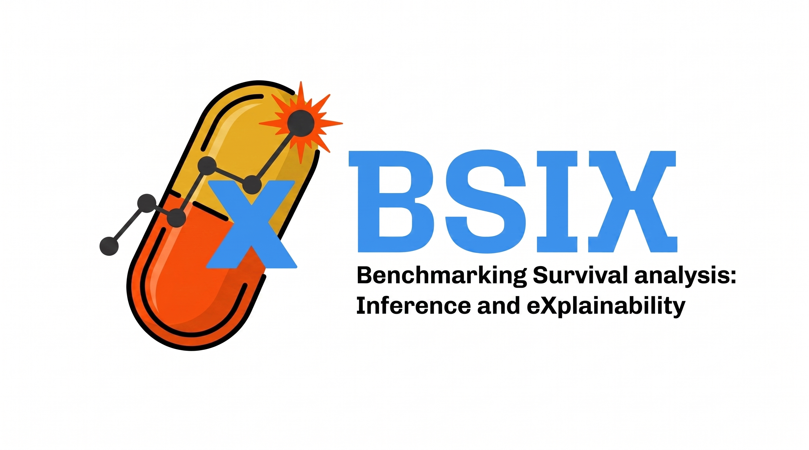

.. bsix documentation master file, created by
   sphinx-quickstart on Wed Jun 17 13:30:53 2026.
   You can adapt this file completely to your liking, but it should at least
   contain the root `toctree` directive.

-------------------------------------

BSIX
==================

.. rst-class:: justificado

**BSIX** is a python package for survival analysis, providing a comprehensive suite of tools and methodologies for analyzing time-to-event data. 
It includes various models, utilities, and functionalities to facilitate the implementation of survival analysis techniques.

Installation
------------------

Normal usage:

.. code-block:: console

    pip install bsix

Tutorial:

.. code-block:: console

    pip install bsix[tutorial]

Source Code
------------------

- Avalaible on GitHub, `ayrna/bsix <https://github.com/ayrna/bsix>`_.
- PyPI project, `project/bsix <https://pypi.org/project/bsix/>`_.

Documentation
------------------

.. toctree::
   :maxdepth: 1

   bsix
